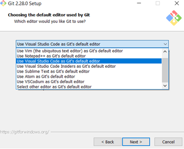

# Git - Version Control System
Git is a distributed Version Control System (VCS). 

## Why Git:
* Many open source geospatial projects are developed using Git.
* Common tool to develop software.
* Better project management.
   * No more project1.py, project2.py, project_final, project_final2 etc.
   * Versioning and tracking changes are systematic, hence, easier.
* GitHub
   * Web based hosting service
   * Free and Open Source for Geospatial (FOSS4G) are hosted on GitHub. Some renowned examples include  [QGIS](https://github.com/qgis), [PostGIS](https://github.com/postgis/postgis) and [GeoSever](https://github.com/geoserver/geoserver). Please note how active these projects are.

* Many online tutorials ease learning.

## Installation
* Download Git from [https://git-scm.com/](https://git-scm.com/)
* Leave the default options until ***Choosing the default editor***
   * Vim is the default, but it could be complicated for beginners.
   * Choose the editor that you feel comfortable with.
   

 